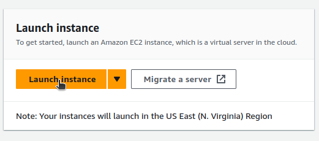
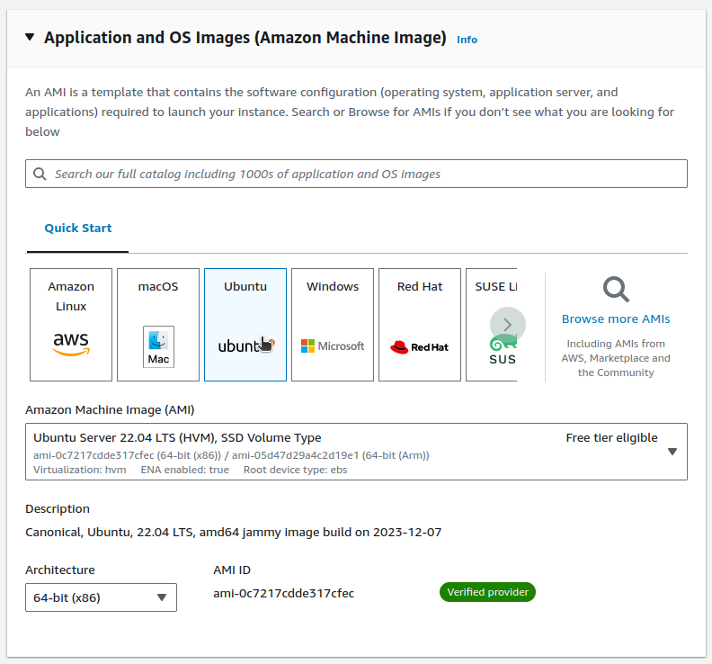
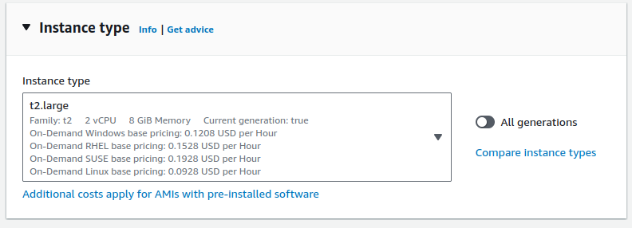
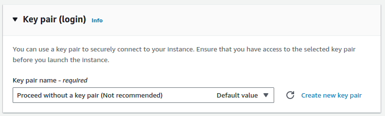
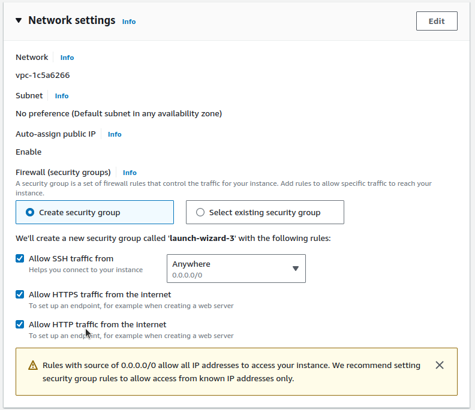
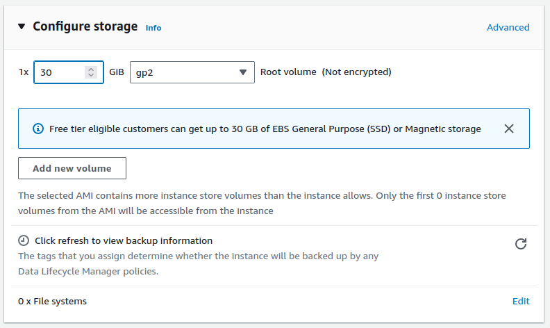
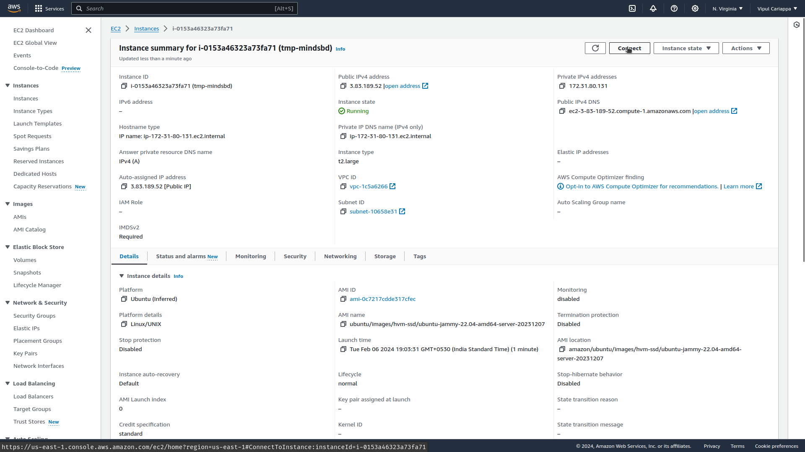
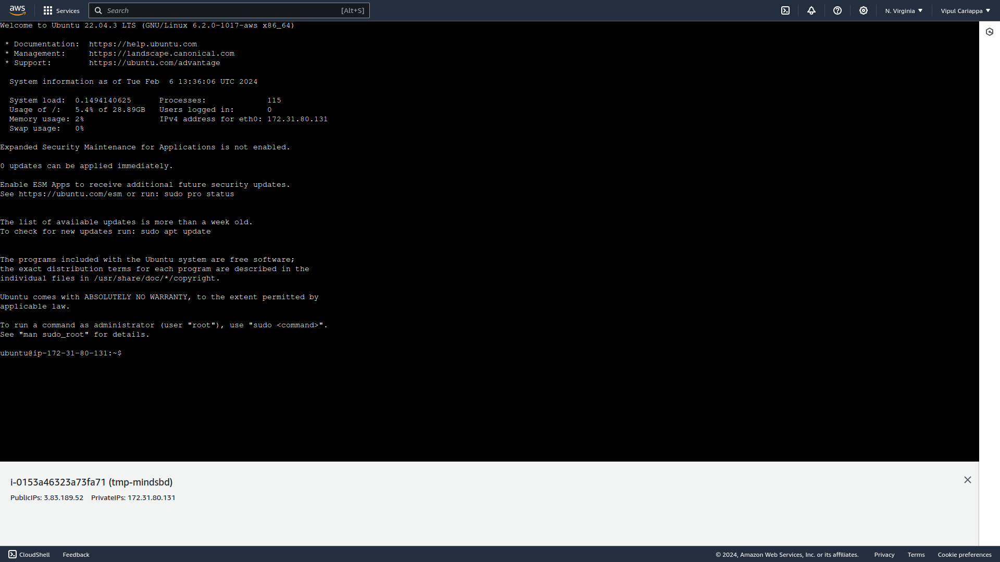
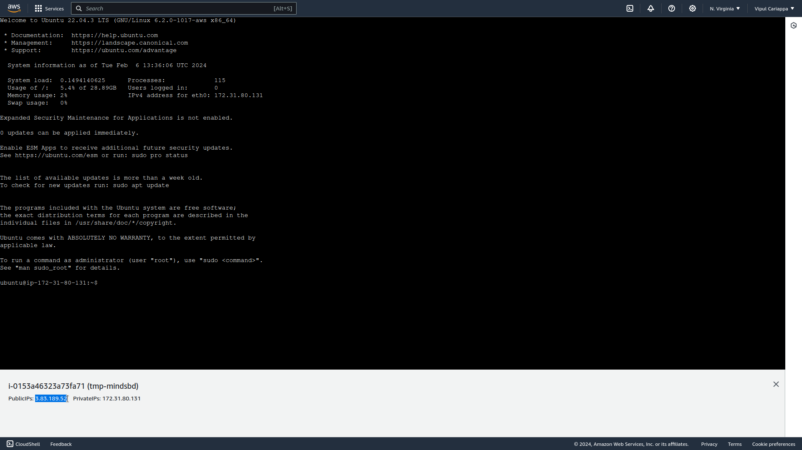

# Instructions to deploy and MindsDB on AWS

## Create and launch EC2 instance

We will be using AWS EC2 instance to deploy MindsBD.

After logging into AWS, navigate to EC2.

And click launch instance


Give your instance a name

Choose Ubuntu as the OS image


We will choose t2.large as the instance.


> MindsDB recommends minimum of 8GB RAM. t2.large offers 8GB RAM. You can select any instance with 8GB or more RAM.

We will select `proceed without a key pair` for "Key pair"


> "Key pair" is use to connect to the instance remotely using SSH. If you have a requirement to connect to the instance remotely then generate a key pair. For our use case we can skip this part.

In network settings enable HTTP and HTTPS traffic.


We will use 30 GiB of general purpose SSD storage


> You can select storage capacity according to your use case. We will go with 30 GiB. It is recommended to use SSD over magnetic disk for better performance.

Then we will launch the instance by clicked "Launch instance" on the right side.

It may take few minutes to setup the instance and start it.

Once the instance is setup and started, navigate to your newly created instance and click on connect at the top left.


Click on connect again if you are asked for. That will connect to instance's shell. Which will look similar to the below.


## Setup Docker to use without admin privileges

### Install Docker 

We will first update all packages
```bash
sudo apt-get update && sudo apt-get upgrade -y
```

To install Docker run
```bash
# Add Docker's official GPG key:
sudo apt-get install ca-certificates curl -y
sudo install -m 0755 -d /etc/apt/keyrings
sudo curl -fsSL https://download.docker.com/linux/ubuntu/gpg -o /etc/apt/keyrings/docker.asc
sudo chmod a+r /etc/apt/keyrings/docker.asc

# Add the repository to Apt sources:
echo \
  "deb [arch=$(dpkg --print-architecture) signed-by=/etc/apt/keyrings/docker.asc] https://download.docker.com/linux/ubuntu \
  $(. /etc/os-release && echo "$VERSION_CODENAME") stable" | \
  sudo tee /etc/apt/sources.list.d/docker.list > /dev/null

sudo apt-get update
sudo apt-get install docker-ce docker-ce-cli containerd.io docker-buildx-plugin docker-compose-plugin -y
```

Check if docker is installed sucessfully by running the following. You should get the docker version installed.
```bash
docker --version
```

### Configure docker to run without admin privileges

Add current user to docker group
```bash
sudo gpasswd -a $USER docker
```

Exit and restart shell. i.e. exit the current tab and connect back to the instance. This is required to reload the privileges.

Restart docker
```bash
sudo service docker restart
```

Change docker context to default
```bash
docker context use default
```

## Running MindsDB with Docker

Create folder to store all files related to MindsDB
```bash
mkdir mdb_data
```


To run MindsDB using docker run
```bash
docker run --name mindsdb -d -v $(pwd)/mdb_data:/root/mdb_storage -p 47334:47334 -p 47335:47335 mindsdb/mindsdb
```

### Install MindsDB specific dependencies

If you want to install any specific packages you can do that using the following

Start shell of MindsDB image
```bash
docker exec -it mindsdb sh
```

Install dependencies
```bash
pip install mindsdb[handler_name]
```

Example
```bash
pip install mindsdb[openai]
```

Exit the shell
```bash
exit
```

Restart the MindsDB image
```bash
docker restart mindsdb
```

## Setup reverse-proxy with nginx with authentication

Install nginx and other dependencies
```bash
sudo apt-get install nginx apache2-utils -y
```

Create a username and password to restrict access
```bash
sudo htpasswd -c -b /etc/nginx/.htpasswd <your username> <your password>
```

Change `<your username>` and `<your password>` with actual username and password in the above command.

Create new nginx configuration file
```bash
sudo nano /etc/nginx/sites-available/mindsdb
```

Add the following lines and save and exit
```text
server {
    listen 80 default_server;
    listen [::]:80 default_server;

    server_name _;
        
    location / {
        proxy_pass http://localhost:47334;
        include proxy_params;
        auth_basic             "Restricted";
        auth_basic_user_file   .htpasswd;
    }
}
```
To save and exit nano `Ctrl-X`, then `y` followed by `enter`


We will remove the default configuration
```bash
sudo rm /etc/nginx/sites-enabled/default
```

Enable new configuration
```bash
sudo ln -s /etc/nginx/sites-available/mindsdb /etc/nginx/sites-enabled/
```
Check if our configurations are correct
```bash
sudo nginx -t
```

Restart nginx
```bash
sudo systemctl restart nginx
```

You can now access your MindsDB server from the public id address found at the bottom left.


You can go to `http://<public ip address>/` to access your MindsDB server. Once you sign in with the username and password you create you will be able to access MindsDB.
